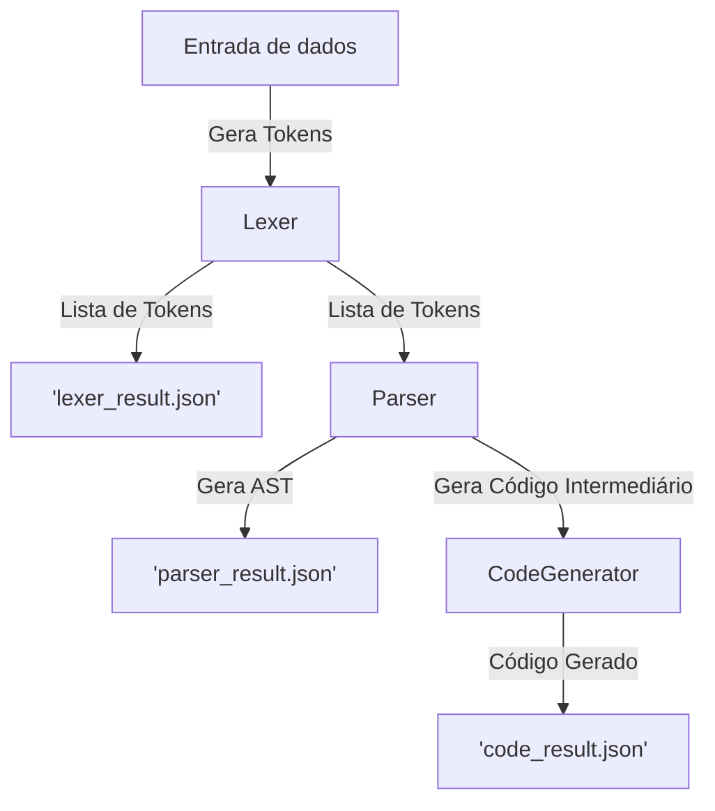

# Implementação de um Compilador com PLY

## Descrição
Este projeto implementa um lexer (analisador léxico) e um parser (analisador sintático) para um código de uma linguagem fictícia, utilizando as bibliotecas PLY (Python Lex-Yacc). O objetivo do código é identificar e analisar expressões matemáticas, estruturas condicionais (`if`, `else`, `elif`), loops (`do-while`), atribuições (`assign`) e funções como `print`. O resultado final é a geração de uma Árvore de Sintaxe Abstrata (AST) e a criação de um código a partir dessa AST.

# Estrutura de Código
O código é dividido em três principais classes: `Lexer`, `Parser` e `CodeGenerator`.

## Lexer (Analisador Léxico)
O Lexer é responsável por analisar o texto de entrada e separa-lo em tokens (elementos léxicos) que são interpretados pelo parser. Ele usa a biblioteca PLY para definir regras de tokenização com expressões regulares.

- Tokens: O lexer reconhece diversos tokens, como identificadores (`ID`), números (`NUMBER`), operadores matemáticos (`+`, `-`, `*`, `/`), operadores de comparação (`==`, `!=`, `<`, `>`) e operadores lógicos (`&&`, `||`), além de palavras-chave (`if`, `elif`, `else`, `do`, `while`, `print`).

<ul>
  <li>
    Funções principais:
  </li>
  <br>
  <ul>
    <li>
      <code>t_ID</code>: Identifica identificadores e palavras-chave.
    </li>
    <li>
      <code>t_NUMBER</code>: Identifica números inteiros.
    </li>
    <li>
      <code>t_COMMENT</code>: Ignora comentários.
    </li>
    <li>
      <code>t_newline</code>: Atualiza o número da linha a cada nova linha.
    </li>
    <li>
      <code>t_error</code>: Lida com caracteres inválidos.
    </li>
    <li>
      Método <code>build()</code>: Constrói o lexer com o módulo lex.
    </li>
    <li>
      Método <code>test(data)</code>: Testa o lexer com um conjunto de dados <code>data</code> de entrada em forma de <code>string</code>, gerando um arquivo <code>JSON</code> com o resultado da análise léxica.
    </li>
  </ul>
</ul>

## Parser (Analisador Sintático)
O Parser é responsável por analisar a sequência de tokens gerada pelo lexer e gerar uma Árvore de Sintaxe Abstrata (AST). Ele usa a biblioteca PLY.yacc para definir regras gramaticais e a precedência de operadores.

<ul>
  <li>
    Regras de Gramática: O parser define várias regras para expressões e sentenças, como:
  </li>
  <br>
  <ul>
    <li>Expressões Matemáticas: Regras para soma (<code>+</code>), subtração(<code>-</code>, multiplicação (<code>*</code>) e divisão(<code>/</code>).</li>
    <li>Comparações: Regras para operadores de comparação como igual (<code>==</code>), diferente (<code>!=</code>), menor (<code><</code>), maior (<code>></code>).</li>
    <li>Atribuições: Regras para atribuições e operações de atribuição como incremento (<code>+=</code>) e decremento (<code>-=</code>).</li>
    <li>Estruturas de Controle: Regras para estruturas condicionais se (<code>if</code>), se não se (<code>elif</code>), se não (<code>else</code>) e loops faça enquanto (<code>do-while</code>).</li>
    <li>Função <code>print</code>: Regra para imprimir valores.</li>
    <li>Método <code>build()</code>: Constrói o parser com o módulo yacc.</li>
    <li>Método <code>test(data)</code>: Testa o parser com um conjunto de dados <code>data</code> de entrada e gera uma AST no formato <code>JSON</code>.</li>
  </ul>
</ul>

## Geração de Código
A classe `CodeGenerator` é responsável por converter a árvore de sintaxe abstrata (AST) gerada pelo parser em código intermediário. O código intermediário usa variáveis temporárias e rótulos para representar as operações e estrutuas de controle do código-fonte.

<ul>
  <li>
    Funções principais:
  </li>
  <ul>
    <li>
      <code>generate_code(node)</code>: Gera o código intermediário para um determinado nó da AST.
    </li>
    <li>
      <code>generate_block_code(block)</code>: Gera o código intermedário para um bloco de código.
    </li>
    <li>
      <code>get_code()</code>: Retorna o código intermediário gerado como uma string.
    </li>
  </ul>
</ul>

## Exemplo de Execução
O código fornece um exemplo de entrada no formate de código fonte que envolve operações aritméticas, estruturas condicionais e loops:

```Python
x = 10;
y = 1;
do {
  x -= 1;
} while ( x > 1 );
if ( x != y || x == y ) {
  print( x );
} elif ( x == y && x != y ) {
  print( y );
} else {
  print( x , y );
}
```
Quando o código é executado:
1. O `Lexer` analisa a entrade e gera uma lista de tokens para cada caractere no código.
2. O `Parser` usa essa lista de tokens para construir uma Árvore de Sintaxe Abstrata (AST).
3. A AST é então processada no `CodeGenerator` para gerar um código intermediário correspondente.



## Resultados
O `Lexer` gera um arquivo `JSON` `lexer_result.json`, que contém uma lista de tokens com seu tipo, valor e número de linha.
<br>
O `Parser` gera um arquivo `JSON` `parser_result.json`, que contém a AST com a estrutura hierárquica dos elementos do código.
<br>
O `CodeGenerator` gera um arquivo `txt` `code_result.txt`, que contém um código intermediário do código fonte fornecido.
<br>
<br>
# Requisitos
1. Python 3.x
2. Biblioteca 'ply' para construção do lexer e parser:
```bash
pip install ply
```
